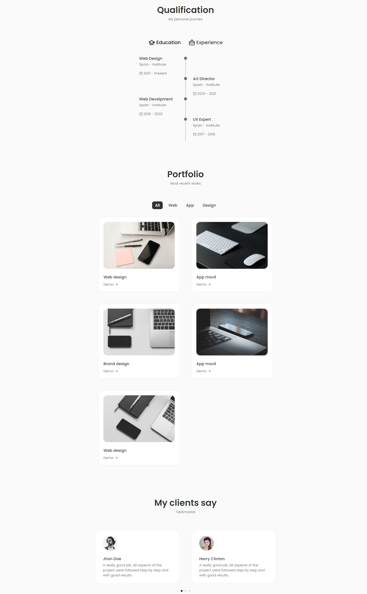

# React Portfolio 01
This design was influenced by the work of [Cryptical Coder](https://www.youtube.com/@CrypticalCoder). Please refer to the following videos as the basis for the design: [Part 1](https://youtu.be/3aCoZudPEKE), [Part 2](https://youtu.be/lvqsSNvfcMo).

## Technologies
This web page was made with the following technologies:
- HTML5
- CSS3
- JavaScript
- React (useState, useRef)
- Swiper
- EmailJS

## Pages
This web page contains 7 sections: **Home**, **About**, **Skills**, **Services**, **Portfolio**, **Contact** and **Footer**.

### Home
#### In this section you will see the name, profession and a short description of this person. Their social networks such as Instagram, Dribbble and GitHub.

### About
#### In this section you will see a more detailed description of this person, their work experience, completed projects and their support availability. In addition, you will be able to download his CV.

### Skills
#### In this section you will see the skills of this person, both as frontend and backend.

### Services
#### In this section you will see the services offered by this person, and the details of each one of them by clicking on them.

### Portfolio
#### In this section you can see the study plan and work experience of this person. You can also see the different projects done. Also, below you can see the testimonials of some clients who worked with this person.

### Contact
#### In this section you will see the options you have to contact this person and also the possibility of sending them a message directly from the website.

### Footer
#### In this section you will see the footer, where there are some shortcuts to go up and review the sections again. In addition, there are also their social networks such as Facebook, Instagram and Twitter.

